# NusaBank — Banking Management System

> Aplikasi manajemen perbankan berbasis desktop (Java + JavaFX)
> sebagai project akhir semester mata kuliah OOP.

## 📸 Preview

### 🌙 Dark Mode

| Login Screen | Admin Dashboard |
|---|---|
| 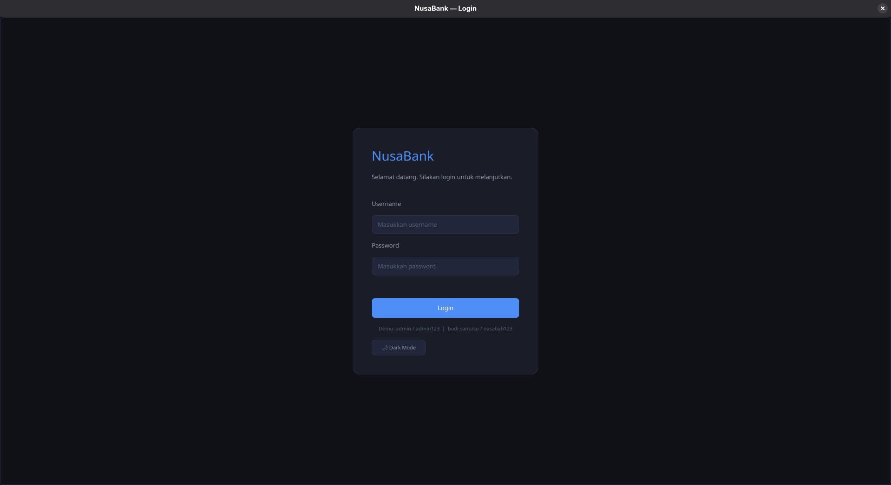 | 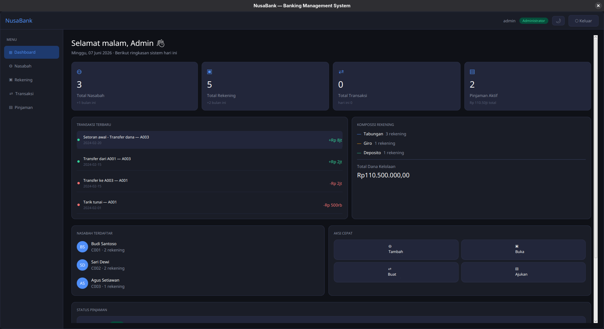 |

| Manajemen Nasabah | Manajemen Rekening |
|---|---|
| 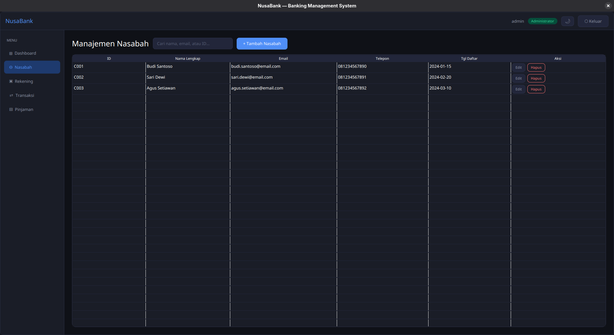 | 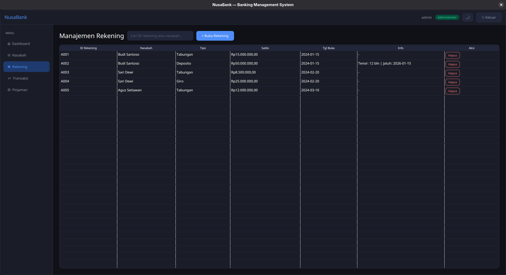 |

| Manajemen Transaksi | Manajemen Pinjaman |
|---|---|
| 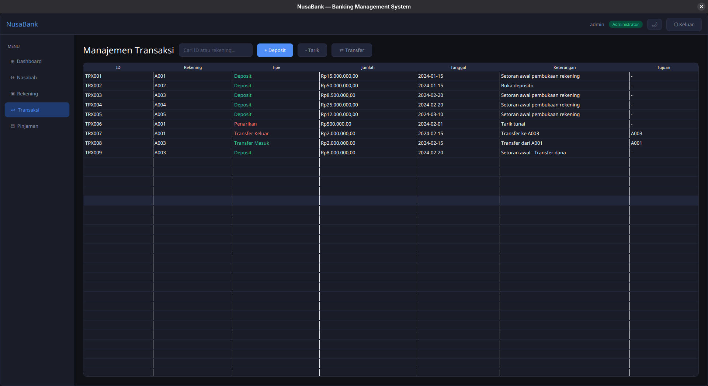 | 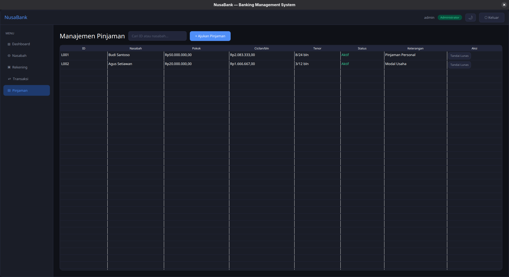 |

| Panel Nasabah | |
|---|---|
| 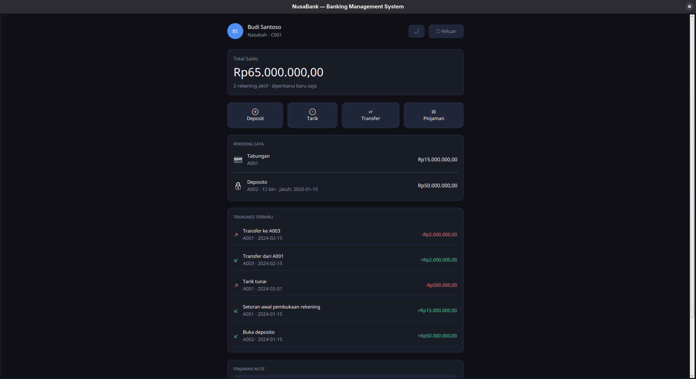 | |

---

### ☀️ Light Mode

| Login Screen | Admin Dashboard |
|---|---|
| 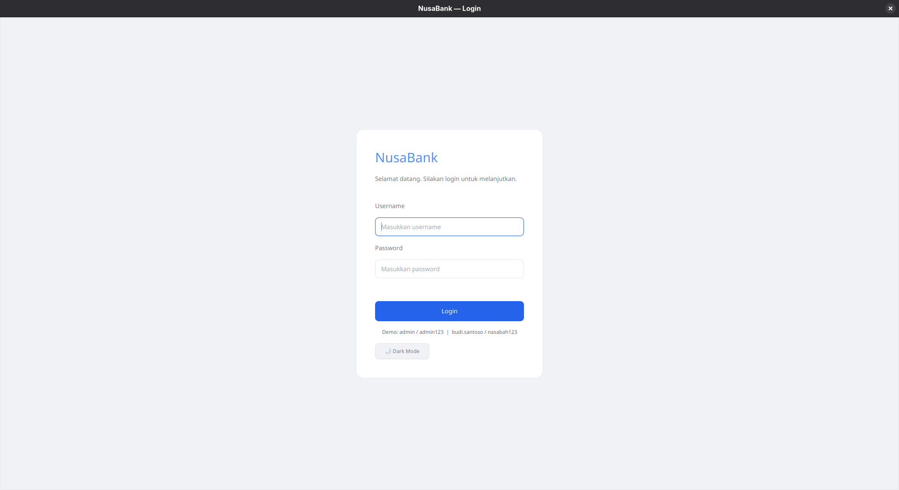 | 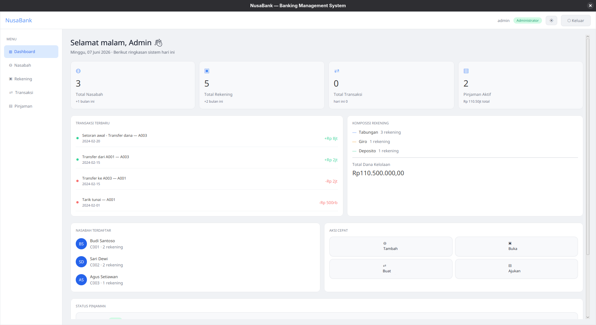 |

| Manajemen Nasabah | Manajemen Rekening |
|---|---|
| 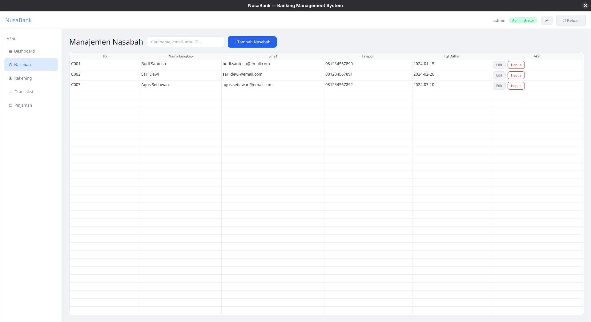 | 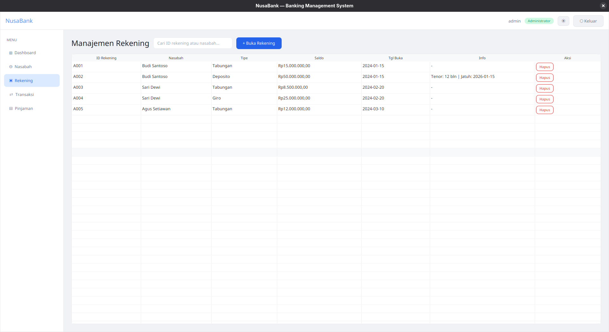 |

| Manajemen Transaksi | Manajemen Pinjaman |
|---|---|
| 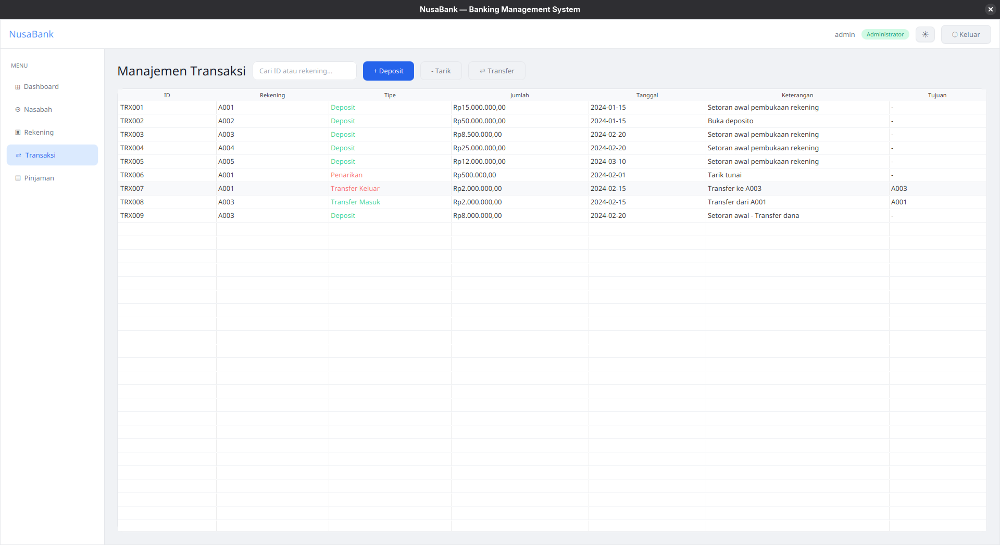 | 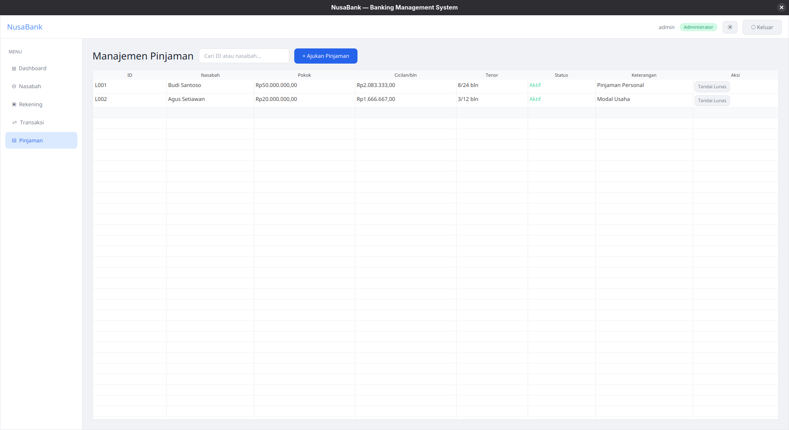 |

| Panel Nasabah | |
|---|---|
| 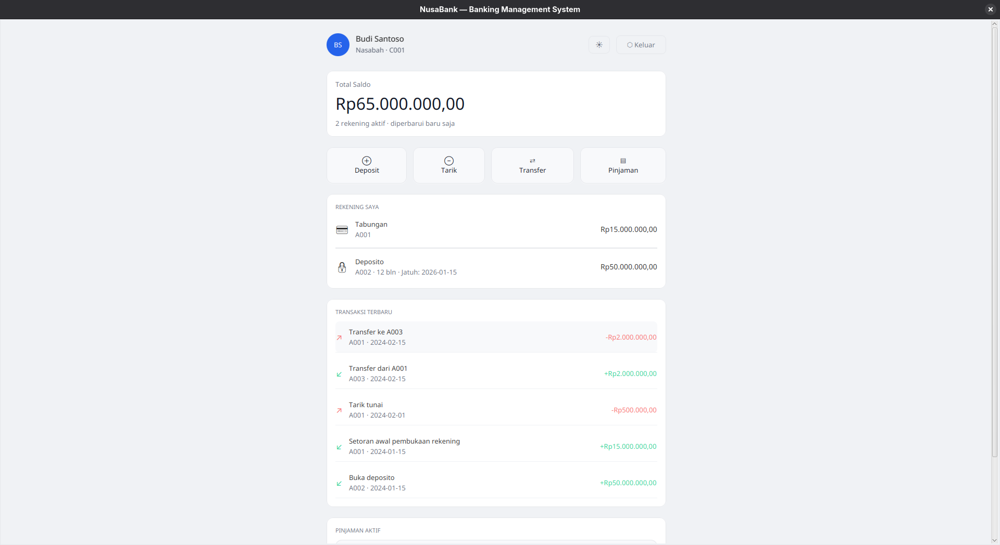 | |

## Branch Strategy
| Branch | Fungsi |
|---|---|
| `main` | Production-ready, stabil |
| `dev` | Integration branch, development aktif |
| `feat/*` | Feature branch per layer |

## Tech Stack
| Teknologi | Versi |
|---|---|
| Java JDK | 25.0.3 LTS |
| JavaFX | 25.0.3 |
| Apache NetBeans | 29 |
| Build Tool | Apache Ant |
| Storage | CSV |

## Author
**Anaya Bintang Prawidya** — [@fleurdes0ir](https://github.com/fleurdes0ir)
